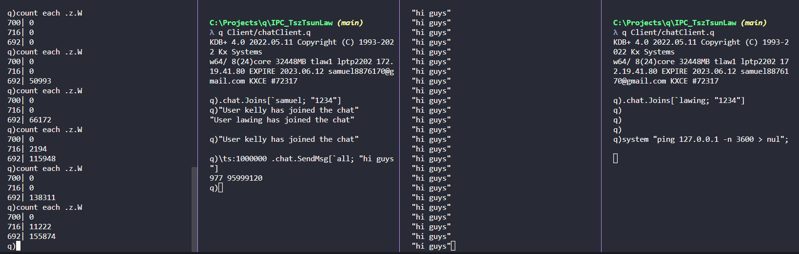

# Discussion answers for written questions in IPC_CMTP.pdf

## 5. How could you find a slow subscriber to a process? Is there protection needed against this, or is it safe for the server process?
- To find the slow subscriber, it is possible to check the .z.W queue that showing how many messages are waiting to be received. The following single line of code could do this:

```q
q) count each .z.W
```

An example using the project itself: 

- One possible way to protect against slow subscribers is to do the followings:
    1. Define who are slow by checking whether the number of messages in waiting queue are constantly over a certain threshold.
    2. Disable slow subscriber handles from the subscription list so the queue won't grow. 
    3. Enable the handles once those are defined as non-slow subscribers.
       - The criteria of being non-slow subscribers might be the number in its queue are lower than the threshold.

## 6. What happens if you open a connection from a client to kdb server while the server is busy? Is there anything you can do about this?
- If client simply open a connection by "`hopen <port>`", it will wait until the server responds. So if server is always busy, then the client is simply always blocked by `hopen`.
- This can be alleviated by setting timeout such as "`hopen (<port>; <timeout>)`" (See line 8 in [chatClient.q](../Client/chatClient.q)).
- Meanwhile, server needs to trap error for any IPC calls in the execution path of `.z.po` since there was an error about invalid IPC handle (See line 19 [chatServer.q](../Server/logging.q)).
  - It seems like even there is a timeout set on client side (i.e. no connecion established), there are some chances that the server will still execute `.z.po`.

## 7. I want to set up a gateway process that can send an incoming query onto multiple HDBs, and then serve other queries while it waits for all the HDBs to respond. What is this behavior known as? What function in the .z namespace needs overwritten for this to happen?
- This behavior is known as deferred response so the gateway can be the middle man in between to retrieve responses, pass queries and free up itself for next user after passing the query.
- `.z.pg` needs to be overwritten with the use of `-30!`.
  - `-30!(::)`: free up itself.
  - `-30!(<handle>; <isError>; <result>)`: send back the result to the user.

## 8. I have connected to a server process and can run most commands fine, e.g. h”1+1”. What could be the reason I get below error when I run the following?

```q
q) h: hopen `:host:port:username:password
q) h "system \"ls ../ \""
   'access
```

- `system` command might not be allowed to be used by others and the server raise `'access` error to client.

## 9. I have opened a handle to another process and try to look at a variable defined on that process, variableX. What could cause the below error?

```q
q) h: hopen `:host:port:username:password
q) h "variableX"
   'limit
```

- It might be because the size of `variableX` is larger than 1TB, and q/kdb+ doesn't allow serializing object > 1TB.
- What IPC call do is serialize-deserialize, so `'limit` error is raised (See [kdb runtime-errors](https://code.kx.com/q/basics/errors/#runtime-errors)).

## 10. What are the differences, pros and cons of sync, async and deferred sync messaging?
|               |Differences                                                        |Pros           |Cons           |
|:--------------|:------------------------------------------------------------------|:--------------|:--------------|
|Sync           |- Send query and wait for responses.                                 |- Guarantee the response from server is received after the IPC call.              |- Long waiting time if the server is always busy which might block the whole process.              |
|Async          |- Send query, leave it and not expecting any responses.              |- No waiting time so no blocking to the process even server is busy.              |- No guarantee of the response from server which makes implementation hard if the calls are intended to retrieve results.              |
|Deferred Sync  |- Combination of Sync and Async. </br></br> - On the client side, users use Sync such that they wait for responses and gateway will send the response back to the users. </br></br> - On the server side, gateway and workers communicate by Async such that workers respond gateway by the callback function.                                      |- User can request to the server natively. </br></br></br> - Gateway is free to receive next query after passing last query to workers.             |- User still need to wait for workers' responses and it might take long time.              |
